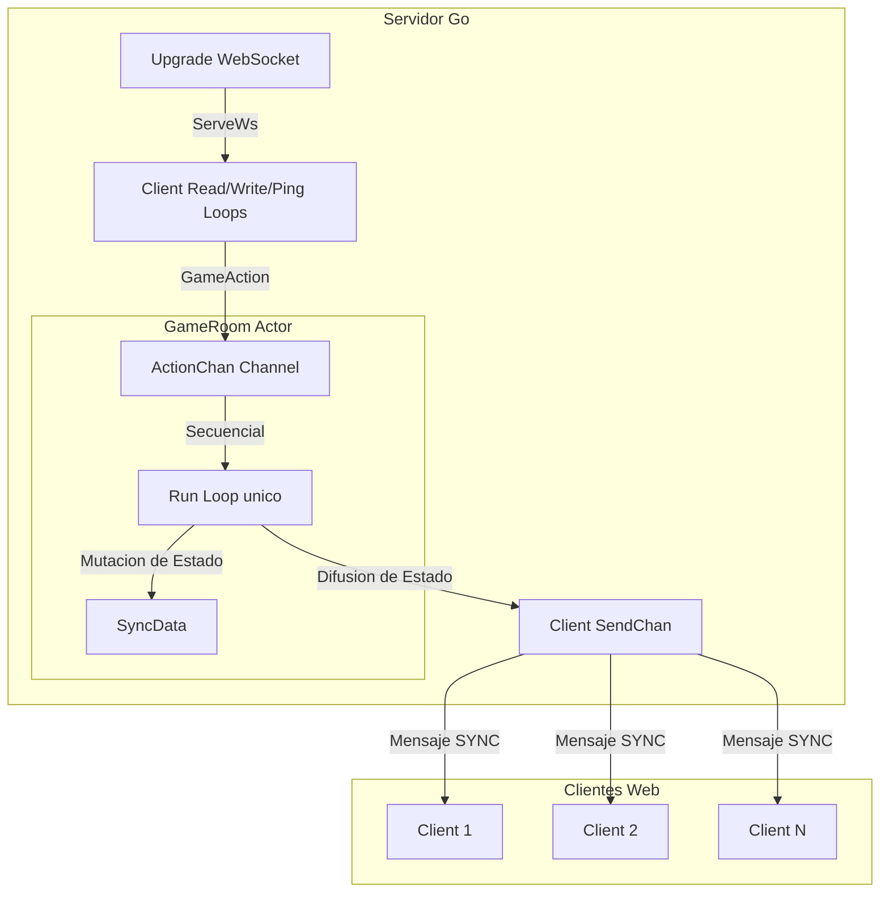

# Arquitectura del Servidor (Go)

El backend de **Cifras y Letras** está implementado en Go 1.26 y está diseñado bajo los principios de alto rendimiento, comunicación en tiempo real de baja latencia y seguridad ante condiciones de carrera (race conditions). Su arquitectura se divide en tres pilares fundamentales: comunicaciones WebSocket eficientes, un modelo de concurrencia basado en el **Actor Model** sin bloqueos mutuos (`sync.Mutex`), y algoritmos de resolución asíncronos optimizados.

---

## 1. Patrón de Concurrencia: El Actor Model (GameRoom)
Para evitar los peligros asociados a la concurrencia multihilo tradicional (como bloqueos mutuos, inanición y condiciones de carrera en el estado del juego), el backend implementa una arquitectura basada en el **Actor Model**.



### 1.1. Centralización en el Event Loop
Toda la lógica de la partida y las mutaciones de estado se agrupan en la estructura `GameRoom`. El acceso a esta estructura está completamente secuencializado:
*   **Canal Único (`ActionChan`):** `GameRoom` expone un canal con buffer `ActionChan chan GameAction` (tamaño de buffer `256`).
*   **Bucle de Eventos Principal (`Run()`):** Se ejecuta en una goroutine dedicada mediante `go room.Run()`. Este bucle lee eventos de forma secuencial y bloqueante:
    ```go
    func (r *GameRoom) Run() {
        defer close(r.runDone)
        for action := range r.ActionChan {
            switch action.Type {
            case "JOIN":          r.handleJoin(action)
            case "LEAVE":         r.handleLeave(action)
            case "READY":         r.handleReady(action)
            case "NAME":          r.handleName(action)
            case "CHOOSE_VOWELS": r.handleChooseVowels(action)
            case "SUBMIT":        r.handleSubmit(action)
            case "TIMEOUT":       r.handleTimeout(action) // Evento interno del Timer
            case "SETUP":         // Solo usado en tests
            }
        }
    }
    ```
*   **Seguridad:** Al procesar un único mensaje a la vez en un solo hilo lógico de ejecución, **no es necesario el uso de exclusiones mutuas (`sync.Mutex`)** para proteger el estado global del juego (`SyncData`), garantizando consistencia total y previniendo condiciones de carrera de lectura/escritura simultánea.

---

## 2. Infraestructura WebSocket Nivel Red (`server.go`)
Las comunicaciones con el cliente se realizan mediante WebSockets utilizando la biblioteca ligera y robusta `github.com/coder/websocket`.

### 2.1. Gestión de Conexiones por Cliente
Cuando se actualiza la conexión HTTP a WebSocket en `/ws` mediante la función `ServeWs`, se genera un identificador de cliente secuencial utilizando enteros atómicos (`clientIDCounter.Add(1)`). Para cada cliente conectado se instancian:
1.  **Canal de Salida Dedicado (`SendChan`):** Canal con buffer de tamaño `256` que contiene mensajes de tipo `ServerMessage`.
2.  **Bucle de Lectura (`readPump()`):**
    *   Corre en su propia goroutine de forma infinita.
    *   Lee del socket JSONs entrantes y los deserializa en una estructura `ClientMessage`.
    *   Envuelve el mensaje recibido en un `GameAction` y lo envía a la cola global del actor `ActionChan`.
    *   **Control de Cierre:** Ante cualquier error de lectura o desconexión física del socket, envía un mensaje de tipo `"LEAVE"` a la cola del actor para que limpie el estado del jugador y cierra de manera segura el socket usando un inicializador único (`sync.Once`).
3.  **Bucle de Escritura (`writePump()`):**
    *   Corre en su propia goroutine de forma infinita.
    *   Escucha del canal individual `SendChan`.
    *   Ante cada mensaje recibido, inicia una escritura estructurada en el socket con un timeout estricto de **10 segundos** para evitar que clientes lentos o colgados mantengan bloqueado el hilo de ejecución.
4.  **Bucle de Latencia (`pingLoop()`):**
    *   Para mantener la conexión viva y detectar de forma rápida cortes silenciosos de red ("half-open connections"), se ejecuta un loop periódico en segundo plano.
    *   Cada **30 segundos** (`PingInterval`), envía una trama de tipo `Ping` nativa al cliente.
    *   Si la red no responde o el ping falla tras **5 segundos** (`PingTimeout`), se aborta la conexión inmediatamente llamando a `closeConn()`.

---

## 3. Algoritmo Solver de Cifras (`solver.go`)
El servidor dispone de un resolvedor exacto de cifras capaz de encontrar la combinación matemática óptima de forma matemática para mostrarla a los jugadores en caso de que nadie la obtenga.

### 3.1. Búsqueda por Fuerza Bruta Inteligente (DFS Backtracking)
El algoritmo está implementado en la función `SolveCifras()` mediante una búsqueda en profundidad (DFS) recursiva que explora todas las combinaciones posibles de operaciones matemáticas elementales:
*   **Estado del Solver (`OpResult`):** Representa un valor numérico alcanzado junto con la lista ordenada de cadenas de texto que describen los pasos intermedios para lograrlo.
*   **Árbol de Decisión:** En cada paso recursivo, el solver selecciona dos números de la lista de números disponibles ($a$ y $b$), los combina aplicando los 4 operadores aritméticos básicos (`+`, `-`, `*`, `/`) y genera una nueva lista donde $a$ y $b$ se sustituyen por el resultado de la operación.
*   **Filtros de Poda Computacional:**
    1.  **Conmutatividad:** Para las cuatro operaciones, solo se computa la combinación si el índice del primer número es menor que el segundo ($i < j$), reduciendo el espacio de búsqueda a la mitad.
    2.  **Restricciones de Dominio:** Las multiplicaciones solo se prueban si ambos operandos son mayores que $1$ (evitando operaciones inútiles con $1$). Las restas solo se calculan si $a > b$ (evitando resultados negativos o cero). Las divisiones solo se computan si $b > 1$ y es una división exacta ($a \pmod b = 0$).
*   **Protección del Hilo de Ejecución (CPU Bound):**
    Dado que es un problema de alta complejidad computacional, el resolvedor se ejecuta con dos salvaguardas críticas para evitar la saturación de los núcleos de CPU del servidor:
    1.  **Límite Estricto de Pasos:** Existe un contador recursivo con un límite estricto de **1.000.000 de iteraciones** (`maxSteps`).
    2.  **Timeout Asíncrono por Contexto:** La búsqueda se inicializa con un `context.WithTimeout` de **1 segundo** (`context.Background(), 1*time.Second`). El bucle DFS comprueba de manera asíncrona en cada nodo si el contexto ha sido cancelado (`<-ctx.Done()`), deteniendo inmediatamente la recursión si expira el tiempo.

---

## 4. Estructura de Datos y Diccionario (`dictionary.go`)
La validación y búsqueda de mejores palabras en la fase de letras requiere una alta eficiencia temporal debido a la naturaleza multijugador del servidor.

### 4.1. Carga y Normalización en Memoria
Al arrancar el servidor en `main.go`, se lee el archivo plano `assets/diccionario.txt` mediante `LoadDictionary()`.
*   **Normalización Estricta:** Para independizar la validación de errores ortográficos de acentuación, cada palabra se convierte a minúsculas y se normaliza eliminando tildes y diéresis mediante un mapeador optimizado (`strings.Replacer` de Go).
*   **Representación en Memoria:**
    *   **Búsqueda en $O(1)$:** Las palabras normalizadas se almacenan como claves en un mapa Hash directo en memoria (`dictionary = make(map[string]string)`), lo que permite validar de forma instantánea si una palabra propuesta por un cliente existe en el diccionario.
    *   **Estructura de Frecuencias:** Para la fase de búsqueda de mejores palabras, las palabras con longitudes entre 5 y 10 caracteres se pre-procesan en la estructura `DictEntry`:
        ```go
        type DictEntry struct {
            original string
            word     string
            freq     [27]int // Vector de frecuencias de caracteres (a-z + ñ)
            length   int
        }
        ```
    *   **Pre-indexación por Longitud:** Se agrupan los índices de las palabras cargadas en cubetas basadas en su longitud física en un array fijo `dictByLength [11][]int`. Esto evita recorrer todo el diccionario y permite realizar búsquedas en cascada descendente desde longitud 10 hasta 5.

### 4.2. Algoritmo de Búsqueda de Mejores Palabras (`GetBestWords`)
Cuando finaliza una ronda de letras, el servidor calcula las 5 mejores palabras posibles que se podían construir a partir de las 10 letras del panel:
1.  Calcula el vector de frecuencia de las letras disponibles en la ronda.
2.  Itera por las cubetas pre-indexadas de longitud de forma descendente (de 10 letras a 5).
3.  Para cada palabra de la cubeta, compara su vector de frecuencias pre-calculado `DictEntry.freq` con el de la ronda:
    *   Si la frecuencia requerida de algún carácter supera el disponible, la palabra se descarta inmediatamente en tiempo constante.
    *   Si es constructible, se añade al conjunto de soluciones.
4.  El bucle se interrumpe de forma óptima en cuanto se recolectan las 5 palabras más largas posibles, garantizando un rendimiento excelente.
