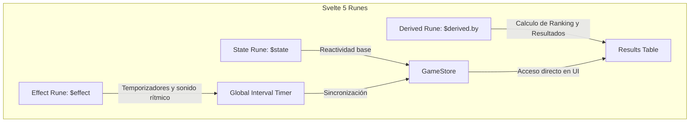

# Diseño de Interfaz e Interacción (UX/UI)

El frontend está implementado como una SPA (Single Page Application) fluida mediante Svelte 5, estructurada con un diseño **Fluent Design Oscuro** y complementado con animaciones suaves y síntesis de audio nativa.

---

## 1. Principios de Estilo y Sistema de Diseño (Fluent Dark Mode)
El apartado visual sigue las pautas modernas de Microsoft Fluent Design, priorizando la profundidad visual, los bordes limpios, la translucidez de elementos y las interacciones físicas reactivas.

### 1.1. Tokens y Variables Globales de CSS (`app.css`)
El proyecto define un conjunto estricto de variables en el `:root` para asegurar la coherencia estética en todos los componentes:
```css
:root {
  --bg: #050510;
  --text: white;
  --accent: #00B0EE;
  --bg-light: color-mix(in oklab, var(--bg), white 20%);
  --text-muted: color-mix(in oklab, var(--text), transparent 20%);
  --accent-muted: color-mix(in oklab, var(--accent), black 20%);

  --success: #0ca40c;           /* Verde de acierto */
  --erase: #820a0a;             /* Rojo para botón de borrado */
  --error: #E82020;             /* Rojo de error */
  --postit-text: #333333;
}
```

### 1.2. Glassmorphism e Interacciones Físicas
*   **Paneles Fluent (`.fluent-panel`):** Se aplica un fondo semi-translúcido con un desenfoque de fondo avanzado mediante `backdrop-filter: blur(20px)` y bordes sutiles en color blanco con baja opacidad (`rgba(255,255,255,0.1)`). Esto otorga una sensación de vidrio esmerilado que flota sobre el fondo oscuro general (`#1a1a1a`).
*   **Botones Reactivos (`.fluent-button`):** Implementan micro-interacciones de traslación física mediante transformaciones de CSS:
    *   **Estado `:hover`:** Se elevan sutilmente (`transform: translateY(-1px)`) e incrementan la opacidad del fondo.
    *   **Estado `:active`:** Se hunden sutilmente (`transform: translateY(1px)`) emulando la pulsación de una tecla física.

---

## 2. Paradigma de Svelte 5: Reactividad Mediante Runes
El cliente abandona por completo los almacenes de datos tradicionales (`writable/readable stores`) y aprovecha el nuevo paradigma de **Runes** de Svelte 5 para una reactividad ultra-precisa y de alto rendimiento.



### 2.1. Gestión de Estado Global (`store.svelte.ts`)
La clase reactiva `GameStore` utiliza la rune `$state` para encapsular las propiedades del juego:
*   `state = $state('IDLE')` para controlar el estado de la conexión WebSocket.
*   `gameState = $state<GameState>(...)` que contiene el objeto sincronizado del servidor (`SyncData`).
*   `toasts = $state<Toast[]>([])` para encolar alertas visuales no bloqueantes.
*   `timeRemaining = $state(0)` para gestionar el minutero.

### 2.2. Lógica Dinámica de Clasificación (`$derived.by`)
En la pantalla de resultados (`Results.svelte`), se utiliza la rune `$derived.by` para computar en tiempo de ejecución de forma reactiva y ordenada el ranking de la ronda actual:
*   Combina la lista de jugadores conectados con las respuestas de la ronda (`otherResults`).
*   **Criterio de Clasificación:**
    1.  Ordena de forma descendente por puntos sumados en la ronda (`points`).
    2.  **En Cifras:** A igualdad de puntos, clasifica de forma ascendente por distancia matemática absoluta (`distance`).
    3.  **En Letras:** A igualdad de puntos, clasifica de forma descendente por longitud de palabra (`word.length`).
    4.  **Desempate:** Aplica un orden alfabético de respaldo por nombre.

### 2.3. Controladores Reactivos del Tiempo (`$effect`)
En la raíz de la aplicación (`+page.svelte`), un bloque `$effect` se suscribe a los cambios del `endTime` del servidor. Cuando el valor es mayor a cero, configura un intervalo de 1s para deducir el tiempo restante y activar el sonido de tic-tac (`sound.playTick()`) si faltan menos de 10 segundos para el fin del juego. El bloque retorna una función de limpieza para destruir el temporizador nativo cuando finaliza el estado.

---

## 3. Síntesis de Audio Nativa (Web Audio API)
Una de las características más avanzadas del frontend es que **no realiza peticiones de red para cargar archivos de sonido estáticos** (como `.mp3` o `.wav`), eliminando retardos de carga y optimizando el ancho de banda. En su lugar, el gestor de sonido (`sound.svelte.ts`) sintetiza audio en tiempo real directamente en el navegador del usuario utilizando osciladores y ganancias nativas de la **Web Audio API**.

### 3.1. Algoritmos de Síntesis
*   **Key Click (`playClick()`):**
    *   **Onda:** Senoidal (`sine`).
    *   **Frecuencia:** Barrido rápido exponencial desde $1200\text{ Hz}$ hasta $300\text{ Hz}$ en $15\text{ ms}$.
    *   **Envolvente:** Ganancia de $0.015$ que cae exponencialmente a $0.0001$ en $15\text{ ms}$. Genera una pulsación muy limpia de percusión.
*   **Éxito / Guardado (`playSuccess()`):**
    *   **Onda:** Triangular (`triangle`), que suaviza los armónicos haciéndolos agradables.
    *   **Estructura:** Acorde arpegiado ascendente de 4 notas: $C_5$ ($523.25\text{ Hz}$), $E_5$ ($659.25\text{ Hz}$), $G_5$ ($783.99\text{ Hz}$), $C_6$ ($1046.50\text{ Hz}$).
    *   **Duración:** Intervalo de $80\text{ ms}$ entre notas con decaimiento exponencial de ganancia de $120\text{ ms}$ por cada nota.
*   **Error / Rechazo (`playError()`):**
    *   **Onda:** Diente de sierra (`sawtooth`), rica en armónicos ásperos.
    *   **Frecuencia:** Rampa lineal descendente desde $180\text{ Hz}$ hasta $100\text{ Hz}$ en un intervalo largo de $250\text{ ms}$.
    *   **Envolvente:** Decaimiento de volumen exponencial de $250\text{ ms}$.
*   **Tic-Tac Urgente del Reloj (`playTick()`):**
    *   **Onda:** Senoidal (`sine`).
    *   **Frecuencia:** Frecuencia fija aguda a $600\text{ Hz}$.
    *   **Envolvente:** Ataque instantáneo con volumen de $0.04$ y decaimiento exponencial estricto de $50\text{ ms}$. Suena rítmicamente en los últimos 10 segundos de la ronda.
*   **Victoria de Ronda (`playVictory()`):**
    *   **Estructura:** Acorde arpegiado ascendente majestuoso: $C_4$ ($261.63\text{ Hz}$), $E_4$ ($329.63\text{ Hz}$), $G_4$ ($392.00\text{ Hz}$), $C_5$ ($523.25\text{ Hz}$) con onda senoidal.
    *   **Impacto de Cierre:** Tras $480\text{ ms}$, se dispara un acorde en bloque masivo a doble frecuencia en onda triangular (`triangle`) imitando un sonido de metales (brass) que decae lentamente en $800\text{ ms}$.

---

## 4. Componente Premium: El Post-it (`Postit.svelte`)
Simula una nota adhesiva realista donde los jugadores realizan sus anotaciones o visualizan las mejores palabras posibles.

### 4.1. Características Físicas y de Estilo
*   **Fondo y Profundidad:** Gradiente realista de color amarillo cálido (`linear-gradient(145deg, #FFEBA1 0%, #D6BA5C 100%)`) y una sombra paralela doble proyectada hacia abajo que le da un aspecto tridimensional suspendido.
*   **Efecto de Cinta Adhesiva (Celo):** Generado mediante el pseudoelemento `.postit::before`. Se simula un trozo de cinta semi-translúcida superior con desenfoque de fondo (`backdrop-filter: blur(2px)`), una ligera rotación angular de $1.5^\circ$ y bordes ligeramente irregulares.
*   **Tipografía:** Fuente manuscrita moniespaciada de máquina de escribir ('Special Elite') cargada desde Google Fonts, utilizada exclusivamente en este elemento para garantizar el contraste de estilos.
*   **Acciones Integradas:** Dispone de un botón discreto de borrado rápido (`BORRAR`) en la esquina superior derecha que activa de forma reactiva el callback de limpieza en el juego.

---

## 5. Diseño Adaptable y Pantallas
*   **Login Form:** Tarjeta centrada con efecto *glass* translúcido y animación física de agitación lateral (`.shake`) si el usuario intenta enviar un nombre vacío.
*   **Lobby Section:** Ranking limpio con indicadores de presencia en tiempo real en base a un punto de estado (`status-dot`) que cambia de color verde (Listo) a gris (Esperando).
*   **Sección de Letras:** Fila de 10 casillas de letras adaptables mediante CSS Grid. Las letras consumidas se desvanecen visualmente con un cambio de opacidad suave a `0.25` y una traslación hacia abajo de $2\text{ px}$.
*   **Resultados Multicolumna:** Tabla estructurada que destaca la fila del jugador actual (`.me`) con un degradado sutil en color azul Fluent y bordes resaltados. Los nombres de palabras válidas en la tabla de resultados integran un botón directo que abre una ventana externa al diccionario oficial de la RAE (`https://dle.rae.es/`) para verificar su significado.
