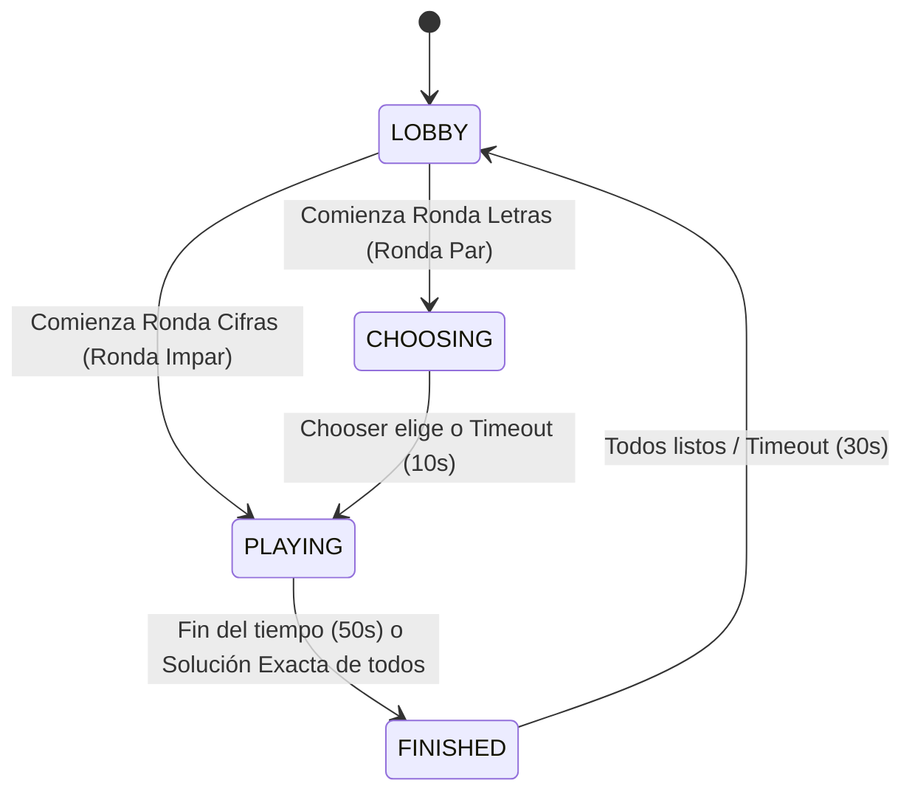

# Game Design Document: Cifras y Letras

## 1. Visión General del Proyecto
*   **Título:** Cifras y Letras
*   **Género:** Concurso / Puzzle Mental / Multijugador en tiempo real
*   **Plataforma:** Web (Responsive, Svelte 5 con Runes, Fluent Design)
*   **Jugadores:** 2–20 por sala (Sala global única con límite estricto `MaxClients = 20`)
*   **Idiomas:** Español (validación con diccionario local)

---

## 2. Flujo de Partida y Máquina de Estados
El juego opera en una máquina de estados controlada por el servidor de Go. Los estados globales son:

### 2.1. Transiciones de Estado
1.  **LOBBY:**
    *   Fase de preparación inicial. Los jugadores pueden conectarse y marcar su estado como "Listo" (`READY`).
    *   **Inicio por Unanimidad:** Si todos los jugadores conectados se marcan como "Listo", la ronda comienza inmediatamente.
    *   **Inicio por Cuenta Atrás:** Si al menos un jugador se marca como "Listo", se inicia un temporizador de cuenta atrás de **30 segundos** (`ReadyTimeout`). Si antes de expirar el temporizador ningún jugador queda como "Listo", la cuenta atrás se cancela.
2.  **CHOOSING (Solo en Rondas de Letras):**
    *   Fase de selección para rondas pares.
    *   Dura estrictamente **10 segundos** (`ChooserTimeout`).
    *   Se escoge secuencialmente a un jugador como seleccionador ("Chooser") según orden alfabético de sus identificadores (`r.chooserIdx = (r.chooserIdx + 1) % len(ids)`).
    *   El "Chooser" debe seleccionar cuántas vocales desea en el panel (3 a 6). Las consonantes completarán las 10 letras del panel.
    *   **Comportamiento ante desconexión:** Si el "Chooser" se desconecta o no realiza su selección en el tiempo límite, el servidor autogenera un número aleatorio de vocales (de 3 a 6) y transiciona al estado `PLAYING` de forma automática.
3.  **PLAYING:**
    *   Fase de resolución activa. Dura estrictamente **50 segundos** (`NumbersRoundDuration` / `LettersRoundDuration`).
    *   **Rondas Impares (Cifras):** Los jugadores operan con los 6 números iniciales para alcanzar el objetivo. Si todos los jugadores envían una respuesta con distancia `0` (exacta), la ronda finaliza de manera anticipada.
    *   **Rondas Pares (Letras):** Los jugadores buscan construir la palabra más larga posible con las 10 letras disponibles.
4.  **FINISHED:**
    *   Fase de presentación de resultados.
    *   Se publican las puntuaciones de la ronda, soluciones exactas (o las mejores palabras posibles) y el ranking en vivo.
    *   Dura un máximo de **30 segundos** (`ReadyTimeout`) para volver al estado `LOBBY` o avanza de forma inmediata si todos pulsan "Siguiente Ronda" (`READY`).

---

## 3. Dinámicas y Reglas de Juego

### 3.1. Fase de Cifras (Rondas Impares)
*   **Generación de Números:**
    *   Se eligen 6 números en total.
    *   **2 Grandes:** Seleccionados aleatoriamente del conjunto de valores fijos `[25, 50, 75, 100]`.
    *   **4 Pequeños:** Seleccionados aleatoriamente del conjunto de valores `[1, 1, 2, 2, 3, 3, 4, 4, 5, 5, 6, 6, 7, 7, 8, 8, 9, 9, 10, 10]`.
    *   **Número Objetivo:** Un entero aleatorio generado en el rango `[101, 999]`.
*   **Reglas de Operación:**
    *   Los jugadores deben combinar los números usando sumas (`+`), restas (`-`), multiplicaciones (`*` / `×`) y divisiones (`/` / `÷`).
    *   Cada uno de los 6 números iniciales se puede usar **como máximo una vez**.
    *   Los resultados intermedios de las operaciones se añaden a la lista de números disponibles y pueden ser reutilizados.
    *   **Restricciones matemáticas estrictas:**
        *   Los resultados de cualquier operación intermedia deben ser números **enteros positivos** ($> 0$). Las restas no pueden dar resultados negativos o cero.
        *   Las divisiones deben ser **exactas** (sin residuo, $a \pmod b = 0$).
*   **Envío de Resultados:**
    *   Se envía una cadena con la secuencia de pasos en líneas separadas (ej. `10 + 5 = 15\n15 * 7 = 105`) y el valor del número final alcanzado.
    *   El servidor valida paso a paso que los números consumidos estén realmente disponibles y que los cálculos sean matemáticamente correctos.
*   **Puntuación de Cifras:**
    *   **Solución Exacta (Distancia = 0):** Otorga **10 puntos** al jugador.
    *   **Solución Cercana (Distancia > 0):** Otorga **7 puntos** al jugador o jugadores que consigan la menor distancia respecto al objetivo.
    *   Los empates otorgan la misma cantidad de puntos a todos los jugadores empatados.

### 3.2. Fase de Letras (Rondas Pares)
*   **Generación de Letras:**
    *   Se disponen exactamente de 10 letras seleccionadas a partir de dos bolsas de distribución barajadas:
        *   **Vocales:** Generadas aleatoriamente a partir del conjunto de distribución en español: `[A, A, A, A, E, E, E, E, I, I, I, O, O, O, U, U]`. El número total viene determinado por la elección del "Chooser" (entre 3 y 6).
        *   **Consonantes:** El resto hasta llegar a 10 letras, extraídas de la bolsa en español: `[B, B, C, C, C, D, D, D, F, G, G, H, H, J, L, L, L, M, M, M, N, N, N, N, Ñ, P, P, Q, R, R, R, R, S, S, S, S, T, T, T, V, X, Y, Z]`.
*   **Reglas de Construcción:**
    *   Los jugadores deben formar la palabra válida más larga posible utilizando únicamente las 10 letras del panel.
    *   Cada baldosa de letra individual se puede usar **únicamente una vez**.
    *   La palabra debe tener una longitud mínima de **5 letras** y máxima de **10 letras**.
*   **Validación de Palabras:**
    *   La palabra enviada es normalizada (eliminando tildes y pasando a minúsculas) y comprobada contra el diccionario cargado en memoria del servidor.
    *   Debe ser posible construir la palabra exacta a partir de las letras aleatorias generadas en la ronda.
*   **Puntuación de Letras:**
    *   El jugador recibe **1 punto por cada letra** de la palabra enviada, siempre que sea válida.
    *   El ganador de la ronda es el jugador que proponga la palabra válida más larga. Si hay empate en longitud, se considera un empate técnico de ronda (aunque cada jugador suma de forma independiente sus respectivos puntos en base al tamaño de su palabra).

---

## 4. Gestión de Conexiones y Sincronización

### 4.1. Sincronización Temporal Eficiente
Para evitar la saturación de los canales WebSockets provocada por el envío continuo de mensajes de "segundos restantes" (ticks), el sistema implementa una arquitectura distribuida:
1.  Al transicionar de estado, el servidor calcula el instante absoluto de finalización en formato Unix Timestamp en milisegundos (`EndTime = time.Now().Add(duracion).UnixMilli()`).
2.  Este timestamp se propaga al cliente dentro del mensaje global de sincronización de estado (`SYNC`).
3.  El cliente Svelte utiliza un temporizador local (`setInterval` de 1s) para deducir el tiempo restante restando el tiempo de su reloj local al `EndTime`.
4.  Si el tiempo restante es inferior o igual a 10 segundos, el cliente activa una alerta visual (el contador cambia a color rojo) y activa un aviso sonoro rítmico (`sound.playTick()`).

### 4.2. Tolerancia a Fallos y Reconexiones
*   **Nombre de Usuario Persistente:** El nombre escogido se guarda localmente en el navegador (`localStorage.setItem('cifras_player_name', name)`).
*   **Estrategia de Reconexión (Exponential Backoff):** Si el WebSocket se interrumpe, el cliente Svelte activa un mecanismo de reconexión automático de hasta 5 intentos con espaciado exponencial de retardo ($2^{\text{intento}} \times 1000$ milisegundos).
*   **Persistencia en el Servidor:** Si un jugador se desconecta temporalmente, su estado (nombre y puntuaciones acumuladas) se almacena y se le asigna de nuevo al reconectar con el mismo ID de conexión (`Client.ID`).
